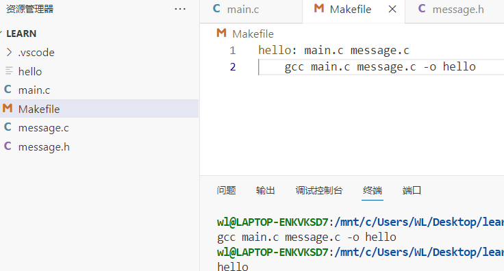

1.	超算：能够执行一般电脑的无法处理的高速运算的计算机。
（1）服务器：采用专用体系结构     /通用
（2）CPU：多核CPU,多颗CPU（并行处理大量并发任务）  /单核
（3）服务器：内存通常价格高容量大，服务器同时运行多个服务程序。
（4）PCle插槽（连接各位专业外设如网卡）及设备分配
挑战：更新的开发工具
通过编译器如何编译到分布式网络。
适应全新的体系架构
编译出的程序利用集群中的高性能网络
分布式系统：Cluster
J节点节点之间怎么才能更高效的利用这些算力。
2.	最基本的工具：SSH（安全外壳协议）为网络服务提供安全的传输环境。本地连接到服务器去做开发。通过计算机网络连接到服务器的shell （充当用户与操作系统内核之间的接口如bash）上面做开发。
Rsyncunix下的应用软件，用于同步更新两台计算机间的文件目录。
SSH：非对称加密（RSA）客户端与服务器端有私钥公钥。客户端用私钥对数据加密服务器端用公钥解锁，也可以反过来。
3.	开发工具：
CPU一个线程去执行1条指令---SISD（单指令流单数据流）
同一指令作用于不同数据利用并行处理提高运算效率,执行的运算器来自不同的硬件。（向量运算：数组中多个元素执行相同操作）---SIMD（单指令多数据流）
基于GPU等并行计算框架，在硬件层面支持大量线程（进程内的执行分支，进程的实际运作单位）一指令可由不同线程并行执行---SIMT(单指令多线程)

4.	高级向量扩展指令集（AVX）x86架构的微处理器中的指令集---WIKIpedia
//指令集：计算机硬件与软件之间的接口规范，CPU能识别和执行的一组指令集合。规定了CPU可以进行的操作，以及操作数的处理方式。（x86）属于不同的CPU架构通常有不同的指令集，指令集决定了CPU的功能和性能特点。提供操作硬件的接口；决定了软件在硬件平台上的兼容性。在AVX中“向量”是计算机邻域（多个数据组成的集合）

GPU图形处理器

5.	库：
（CUDA）:集成技术
优点：更成熟的编译器，更丰富的库。
（ROCM）:用于GPU编程。
(OpenCL)开放计算语言：为异构平台编写程序的框架。可由CPU GPU DSP FPGA或其他类型的处理器与硬件加速器组成。
优点：跨平台，基于c c++.
OpenMP：支持跨平台，共享内存的多线程并发的编程API

6.	性能调优：CPU高速执行程序：将数据缓冲到三层的缓冲架构L1L2L3的cash越往上容量小延迟低成本高（避免对内存的频繁访问）
时间局限性和空间局限性。
优化方法：
（1）	循环展开：减小循环控制开销增加指令集并行度。
（2）	内存预取：用到的数据从内存预取到缓存
（3）	分支预测：预测分支走向提前准备后续指令，减少流水线停顿。
7.	流水线结构：cpu指令-取指令-译码-执行-访存-写回
8.	RDMA:远程直接内存访问：数据中心邻域绕过远程主机操作系统内核直接访问内存数据的技术，节省了CPU资源，提高系统吞吐量。
GDB Makefile

【有道云笔记】gdb
<https://note.youdao.com/s/djHLvNhj>

