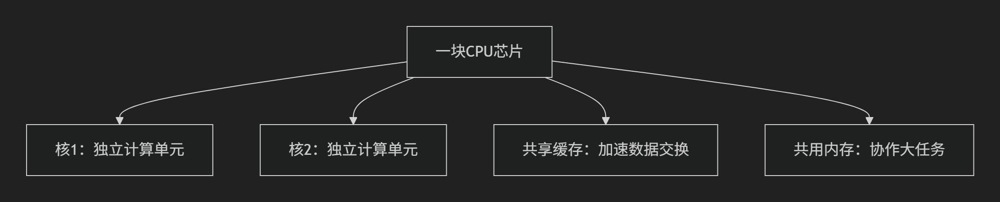
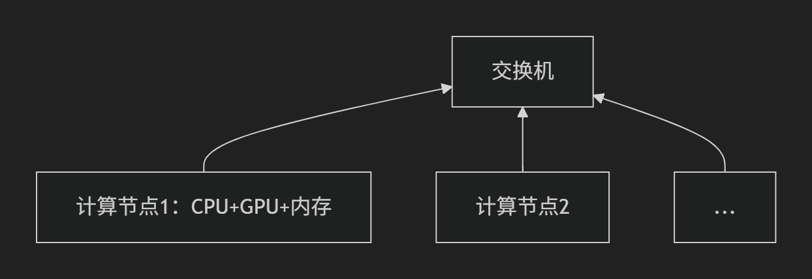
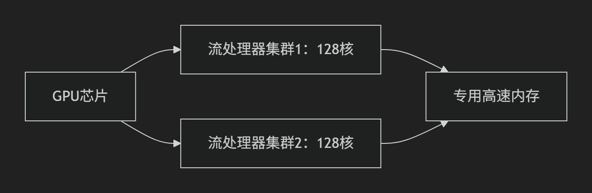
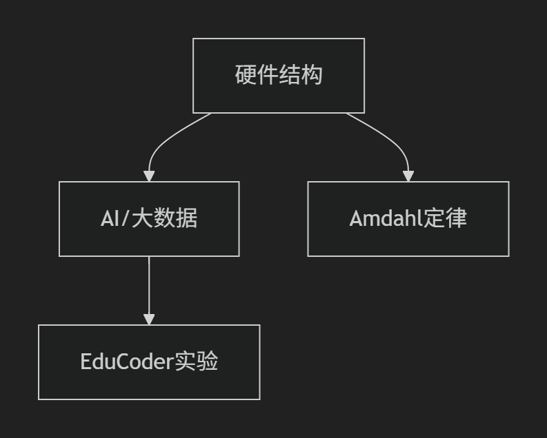

## 课程大纲​​
### 并行计算导论​​
 定义与核心概念
 为何需要并行计算（硬件瓶颈与应用需求）
-  ​​并行计算机组织​​
- 互连网络技术（拓扑结构/通信协议）
- ​​Frontier​​——全球首台百亿亿次级（Exascale）超级计算机案例
​- ​并行计算机分类​​
- SIMD/MIMD等体系结构对比
​​- 并行编程模型​​
- 共享内存（如OpenMP）、消息传递（如MPI）等模型
​​- 实验练习​​
- 熟悉头歌平台（EduCoder）开发环境

---
### 核心内容整合与分析
​- ​并行计算定义与性能指标​​本质：

- 利用​​多核处理器/计算机集群​​分解大任务为并行子任务.

- 性能标准：​​FLOPS​​（浮点运算/秒），单位跨越吉咖(10⁹)到艾(10¹⁸)级.

- 峰值计算公式：
FLOPS = 核心数 × 主频(Hz) × 每周期浮点运算数

- ​技术驱动力

### ​硬件革新​​：摩尔定律持续但单核性能遇物理极限

- ​三大瓶颈​​：
→ 频率墙（提频收益递减）
→ 功率墙（散热限制提速）
→ ILP墙（指令级并行挖掘耗尽）
- ​应用需求​​：
AI/大数据等计算密集型任务必须依赖并行
​​多核架构的必然性​
​​功耗模型​​：
功率 ∝ 电压² × 频率 ∝ 频率³（立方关系）
​​对比实验​​：
方案	频率变化	性能增益	功耗变化
单核超频	+50%	1.5x	3.3x
双核低频	-25%	峰值不变	0.8x
​​结论​​：多核通过降低单核频率大幅优化能效比
- ​并行实现挑战​:
任务划分策略（如何分解问题）
负载均衡（任务分配算法）
进程间通信（结果同步机制）
性能评测指标（加速比/效率）
### 关键技术图解
graph LR
A[单核性能极限] --> B[频率墙/功率墙] 
B --> C[多核架构] --> D[能效优化]
D --> E[并行计算三要素]
E --> F1[任务分解]
E --> F2[通信协同]
E --> F3[性能评估]
### 学习注意要点
​​功耗公式推导​
由 功率 ∝ V²·f 且 f ∝ V → 代换得 功率 ∝ f³
例证：双核25%降频 → 单核功耗(0.75)³≈0.42 → 双核总耗2×0.42=0.84x
​​历史演进印证​
1971-2003：单核频率从 ​​740kHz→3.4GHz​​（4600倍提升）
2003-2013：多核时代频率​​停滞于3.5GHz​​，转向核心数增长
​​现实意义​​
手机/笔记本已普及多核（图3），编程需考虑并行优化
超算发展目标：突破​​艾级(exa-FLOPS)​​计算（图1）
建议结合 ​​Amdahl定律​​ 和 ​​通信开销模型​​ 深入理解并行效率边界。当前材料已涵盖并行计算的核心理论框架，后续可延伸学习MPI/OpenMP等并行编程实践。
## 二、并行计算的三种武器​​（对应Slide 4-8）
1. 武器1：多核CPU（Slide 5）

2. 武器2：计算机集群（Slide 6）

3. 武器3：GPU加速（Slide 7-8）

简单任务海量并发时碾压式胜出
### 三、并行系统的神经系统：互连网络​​（Slide 9-10）
两种网络对比
类型	运作方式	现实类比	缺陷
​​静态网络​​（Slide 10）	固定线路（如全连接）	电话专线：点对点直连	100台电脑需4950条线！
​​动态网络​​（Slide 9）	智能路由（如交换机）	快递网络：智能分拣	延迟略高但成本可控
​​为什么不用全连接​​？
公式：链路数= 
2
p×(p−1)
​
 
 1000台电脑需50万条线！仅布线重量就超5吨（Slide 10）
​​四、知识落地建议​​
​​理解层次​​：

​​动手实践​​（课程Lab）：
在​​头歌平台​​尝试多线程任务分割
（例：用4个线程并行计算1亿内素数）
​​前沿关联​​：
对比手机芯片（8核CPU+GPU）vs Frontier超算架构
思考：为什么AlphaGo需要1920块GPU+280块CPU？
注：掌握此知识框架后，后续学习MPI/OpenMP等编程模型将事半功倍。课程参考Dongarra、Demmel教授的经典案例，正是为构建从理论到实践的闭环。

------
## 总结
一、为什么需要并行计算？​​
​​数据爆炸时代​​（图1-3）
​​科学需求​​：台风预测、基因分析需处理海量数据
​​商业革命​​：电商推荐、AI大模型（如ChatGPT）依赖万亿级数据训练
​​核心矛盾​​：
单核CPU像小水管 → 数据洪流像大瀑布（根本接不住！）

​​硬件性能瓶颈​​（隐含结论）
CPU单核频率近20年停滞在3-4GHz（物理极限）
​​唯一出路​​：
» 多核协同 » GPU海量微核 » 超算集群
​​二、三种并行硬件架构​​
​​类型​​	​​特点​​	​​应用场景​​	​​案例​​
​​多核CPU​​（图5）	2-128核共享内存 （像厨房团队协作）	手机/笔记本日常任务	手机游戏、多开网页
​​计算机集群​​（图4,6）	多台电脑组队作战 （用网络交换数据）	超级计算任务	Frontier超算（9472节点）
​​GPU加速器​​（图7-8）	专为并行设计 （万核工厂模式）	AI训练/图形处理	RTX 4090（16384核+512个AI核心）
​​GPU强大本质​​：

传统CPU = 1位数学教授解方程
现代GPU = 1万个小学生同时算加减法（简单任务碾压式胜利）
​​三、并行系统的“高速公路”​​
​​互连网络​​（图9-10）

​​动态网络​​（主流方案）
智能交换机调配数据（像快递中转站）
​​优势​​：1台交换机连1000台电脑（成本可控）
​​四、一句话掌握核心​​
​​并行计算 = 用人海战术解决单核CPU搞不定的超级任务​​

战术1：​​多核CPU​​（协作小分队）
战术2：​​GPU​​（万人工厂流水线）
战术3：​​超算集群​​（国家工程兵团）
- ​​关键启示​​：AlphaGo击败人类、ChatGPT对话奇迹——背后全是这三种硬件组合的并行计算力量！

